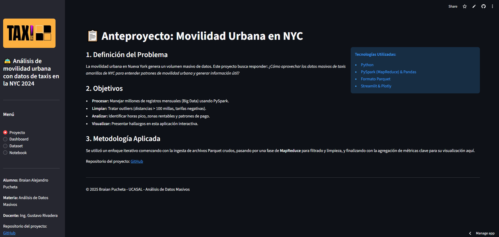
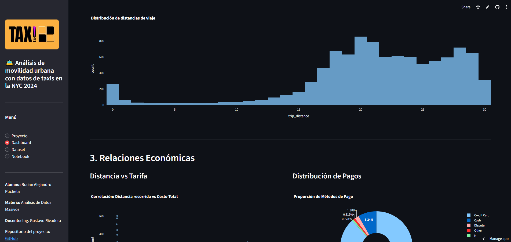
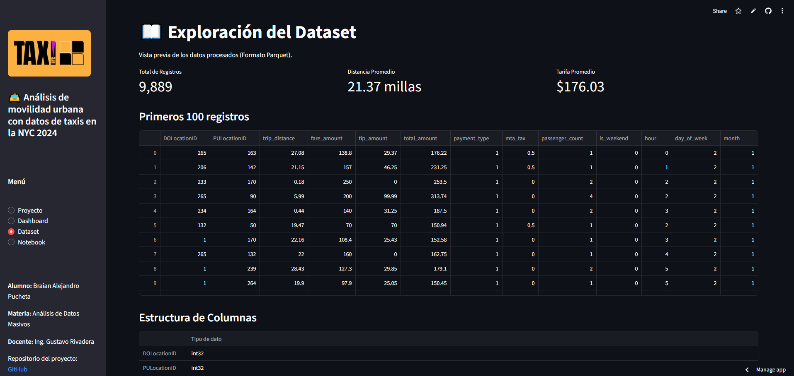
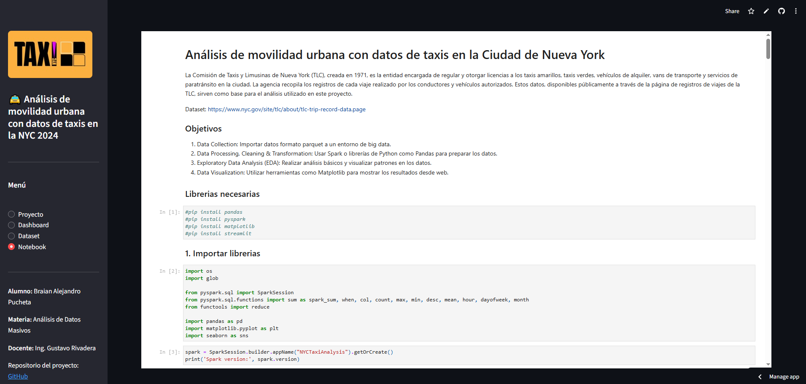

# Análisis de Movilidad Urbana en NYC – Dashboard Interactivo
Este proyecto presenta un análisis exploratorio de datos de movilidad urbana utilizando registros de viajes de taxis de la ciudad de Nueva York. La aplicación está desarrollada con Streamlit y permite visualizar patrones temporales, económicos y de comportamiento de los usuarios.

## Demo Online 
 [Link](https://tf-adm-analysis-taxis-nyc.streamlit.app/)

## Objetivo del Proyecto
Explorar y comprender los patrones de movilidad urbana a partir de los datos de taxis amarillos de NYC. La aplicación incluye:
- Visualización de viajes por hora del día.
- Distribución de distancias recorridas.
- Relaciones económicas entre tarifas y distancias.
- Análisis del comportamiento de pago.
- Comparación entre días laborales y fines de semana.
- Vista previa del dataset procesado (Parquet).
- Visualización del notebook utilizado para el procesamiento.

## Tecnologías Utilizadas
- Python
- Streamlit
- Plotly
- Pandas
- PySpark (procesamiento previo)
- Formato Parquet
- HTML embebido para mostrar el notebook

## Vista del Proyecto

## Vista del Dashboard

## Vista del Dataset

## Vista del Notebook

